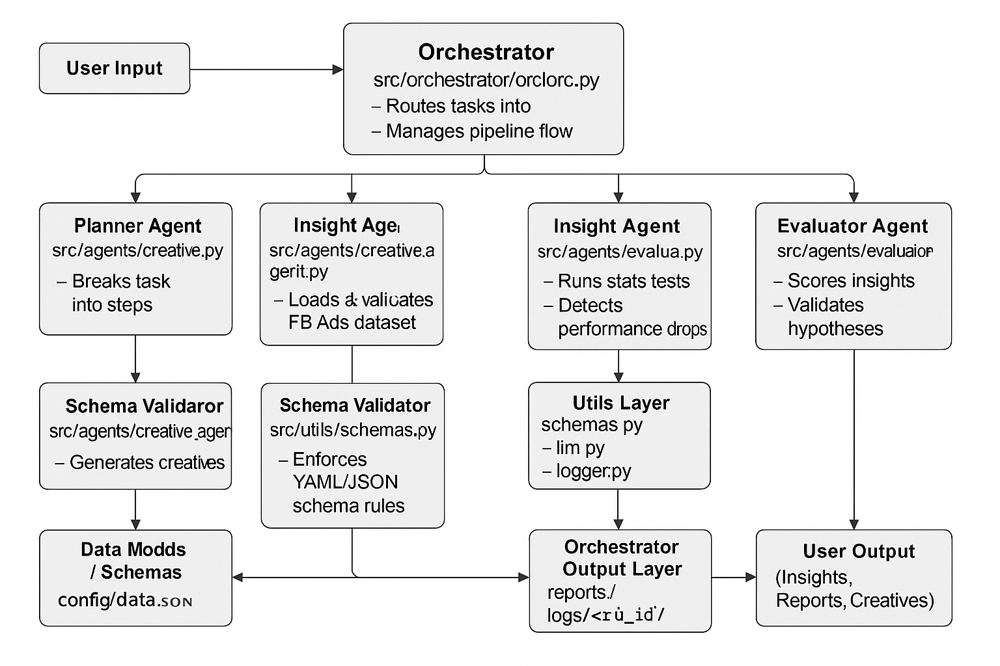

An end-to-end, production-style agentic system that analyzes Facebook Ads performance, identifies performance drops, validates hypotheses using statistical methods, and generates data-driven creative recommendations.

✅ Features (V2 Requirements Met)

✔ Schema validation using YAML + strict checks

✔ Planner → Insight → Evaluator → Creative pipeline

✔ Robust evaluation: t-test / bootstrap, effect size, change-point detection

✔ Impact scoring + structured evidence blocks

✔ Per-agent logging with run-scoped log folder

✔ JSON + Markdown reports

✔ Git commit hash embedded in metadata

📦 Installation
git clone <your-repo-url>
cd kasparro-fb-analyst
pip install -r requirements.txt

▶️ Running the System

From the project root:

python run.py "Analyze ROAS drop for campaign_1"

Outputs will be written to:

/reports/
    insights_<run_id>.json
    creatives_<run_id>.json
    report_<run_id>.md
    run_metadata_<run_id>.json
/logs/<run_id>/

🧠 System Design (Short & Clear)
             
           

    

📁 Folder Structure
kasparro-fb-analyst/
│
├── src/
│   ├── agents/
│   │   ├── planner.py
│   │   ├── data_agent.py
│   │   ├── insight_agent.py
│   │   ├── evaluator.py
│   │   └── creative_agent.py
│   │
│   ├── orchestrator/
│   │   └── orchestrator.py
│   │
│   ├── utils/
│   │   ├── logger.py
│   │   ├── llm.py
│   │   ├── schemas.py
│   │   └── schema_validator.py
│
├── prompts/
├── config/
│   ├── config.yaml
│   └── data_schema.yaml
│
├── data/
├── reports/
└── logs/

🧪 Example Output Snippet
{
  "hypothesis_id": "hyp_a13c7",
  "status": "VALIDATED",
  "impact": "high",
  "confidence_final": 0.74,
  "evidence": {
    "baseline_ctr": 0.045,
    "current_ctr": 0.030,
    "ctr_delta_pct": -32.1,
    "effect_size": -0.72,
    "p_value": 0.004,
    "change_point": 18
  }
}
